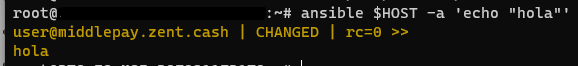

# Ansible-02

#### Comandos en un servidor remoto:

```shell
# My Host
export HOST="user@coin-gateway.com"
# Connect to the Host
ssh $HOST
# En Consola
echo "hola"
# Con Ansible
ansible $HOST -a 'echo "hola"'
```



##### Usando módulos

```shell
# APT con sudo
# Para sudo --> -b (Become)
# Para Pass --> -K

ansible $HOST -m apt -a 'name=vim state=present' -b -K
```

Cuando lanzas comandos con `ansible` los ejecuta con el usuario `(whoami)`

```shell
# Lanzar comando con otro user
ansible -i hosts.txt middlepay.zent.cash -m ping -u user
```


##### [Module Categories](https://docs.ansible.com/ansible/2.9/modules/modules_by_category.html)

- [All modules](https://docs.ansible.com/ansible/2.9/modules/list_of_all_modules.html)
- [Cloud modules](https://docs.ansible.com/ansible/2.9/modules/list_of_cloud_modules.html)
- [Clustering modules](https://docs.ansible.com/ansible/2.9/modules/list_of_clustering_modules.html)
- [Commands modules](https://docs.ansible.com/ansible/2.9/modules/list_of_commands_modules.html)
- [Crypto modules](https://docs.ansible.com/ansible/2.9/modules/list_of_crypto_modules.html)
- [Database modules](https://docs.ansible.com/ansible/2.9/modules/list_of_database_modules.html)
- [Files modules](https://docs.ansible.com/ansible/2.9/modules/list_of_files_modules.html)
- [Identity modules](https://docs.ansible.com/ansible/2.9/modules/list_of_identity_modules.html)
- [Inventory modules](https://docs.ansible.com/ansible/2.9/modules/list_of_inventory_modules.html)
- [Messaging modules](https://docs.ansible.com/ansible/2.9/modules/list_of_messaging_modules.html)
- [Monitoring modules](https://docs.ansible.com/ansible/2.9/modules/list_of_monitoring_modules.html)
- [Net Tools modules](https://docs.ansible.com/ansible/2.9/modules/list_of_net_tools_modules.html)
- [Network modules](https://docs.ansible.com/ansible/2.9/modules/list_of_network_modules.html)
- [Notification modules](https://docs.ansible.com/ansible/2.9/modules/list_of_notification_modules.html)
- [Packaging modules](https://docs.ansible.com/ansible/2.9/modules/list_of_packaging_modules.html)
- [Remote Management modules](https://docs.ansible.com/ansible/2.9/modules/list_of_remote_management_modules.html)
- [Source Control modules](https://docs.ansible.com/ansible/2.9/modules/list_of_source_control_modules.html)
- [Storage modules](https://docs.ansible.com/ansible/2.9/modules/list_of_storage_modules.html)
- [System modules](https://docs.ansible.com/ansible/2.9/modules/list_of_system_modules.html)
- [Utilities modules](https://docs.ansible.com/ansible/2.9/modules/list_of_utilities_modules.html)
- [Web Infrastructure modules](https://docs.ansible.com/ansible/2.9/modules/list_of_web_infrastructure_modules.html)
- [Windows modules](https://docs.ansible.com/ansible/2.9/modules/list_of_windows_modules.html)


